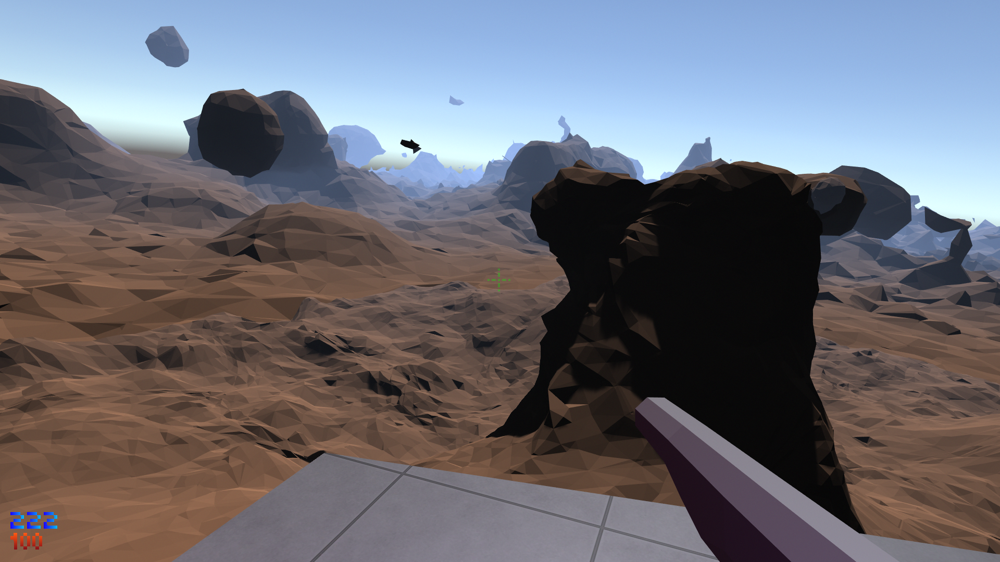

# TetraGen isosurface mesh generation for Unity
Generate isosurface terrain and effects!


## Features
* Infinite, streaming terrain in all directions. Pair with a floating origin script to go as far as you want!
* Generate static geometry for no load on Update();
* Fast enough to generate shape-changing meshes in real time
  * Add TetraGenShapes to rigidbodies to make things like lava lamps!
* Build your own organic geometry using signed distance field shapes
* **Fully customizeable algorithms!** Easily write your own compute shaders for:
  * Marching cube algorithms
  * Signed-distance field lattice positions
  * Signed-distance field shapes
  * Signed-distance field shape blend modes
 
## How it Works
* **TetraGenMaster** are Components paired with a TetraGenChunk to convert sets of shapes into meshes.
Its job is to determine which chunks need to be generated. The meshes can be generated and exported,
or left as-is while letting TetraGenMaster run uninterrupted.
* **TetraGenChunk** are Compnents that contain verything needed to generate a mesh.
It can be operated independently from TetraGenMaster and can be controlled by custom scripts.
* **TetraGenShapes** are Components that store signed-distance field shape information. The Transform's
position, rotation, and scale are incorporated into the shape by passing its *world2local* and *local2world*
matrices to the compute shader along with the rest of the information.
  * TetraGenMasters are given a transform containing a number of these in its children and are added in
    the order they appear in the GameObject heirarchy. 
  * TetraGenChunk is fed a list of these to generate the mesh.
* **TGKernels** are ScriptableObjects used to reference kernels in compute shaders used for the four aspects of the generation.
  * **TGMeshKernel** references marching cube algorithms
  * **TGPositionKernel** references signed-distance field lattice algorithms
  * **TGShapeKernel** references signed-distance field algorithms
  * **TGBlendKernel** references signed-distance field shape blending algorithms

## The real-time generation procedure at a glance
```csharp
Pseudocode:

class BasicallyWhatTetraGenMasterDoes : Monobehaviour
{
    TetraGenChunk chunk;

    void Start()
    {
        // Allocate memory buffers for generation
        chunk.GenerationStart();
    }

    void Update()
    {
        // Generate the signed-distance fields on GPU
        chunk.SetTriangleBuffer(TetraGenShape[] shapes, ...)
        {
            // sets the positions in the signed-distance field lattice
            chunk.TGPositionKernel.Dispatch(...);

            foreach(TetraGenShape shape in shapes)
            {
                // Set shape to the blend buffer
                shape.TGShapeKernel.Dispatch(...);
                // Apply the blend buffer to the main signed-distance field buffer
                shape.TGBlendKernel.Dispatch(...);
            }
            
            // form triangles applying the marching cube algorithm to the signed-distance field
            chunk.TGMeshKernel.Dispatch(...);
        }

        // retrieve triangles from the gpu and form meshes and gameobjects out of them.
        chunk.GenerateMeshes(...)
    }

    void OnDestroy()
    {
        // De-allocate buffers when you're finished.
        chunk.GenerationEnd();
    }
}
```
